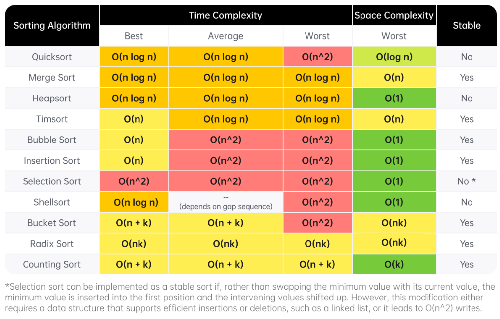
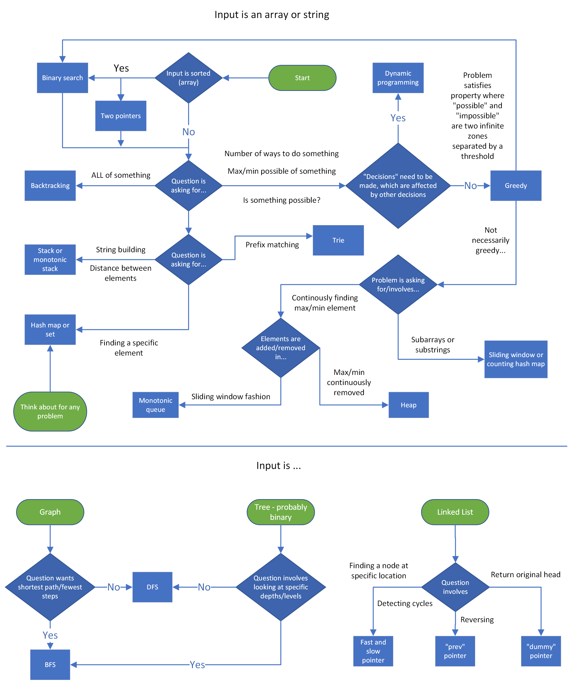

# Data Structures and Algorithms

## Notes

### Bit Manipulation

- Get i-th bit: `(x >> i) & 1`
- Set i-th bit: `x | (1 << i)`
- Clear i-th bit: `x & ~(1 << i)`
- Check if power of 2: `n > 0 and (n & (n - 1)) == 0`
- XOR Property: `a ^ a = 0`, `a ^ b = 1` if a != b
- Check if even number: `( n & 1 ) == 0`
- Check if odd number: `( n & 1 ) == 1`
- Clear the lowest set bit: `n & (n - 1)`
- Get the lowest set bit: `n & -n`

### Math

- Sum of first `n` natural numbers: `( n * ( n + 1 ) ) // 2`
- Sum of first `n` odd natural numbers: `n * n`
- Sum of first `n` even natural numbers: `n * (n + 1)`
- Even number: `n = 2k`
- Odd number: `n = 2k + 1`

### NP-Complete

- NP-Complete Problems:
  - Traveling Salesperson Problem (TSP)
  - Longest Path Problem
  - Hamiltonian Path Problem
  - Graph Coloring Problem
  - The Knapsack Problem
  - Subset Sum Problem

### Python

- Strings are immutable and that's why they can be used as keys to dictionaries
- Use `''.join(list_of_strings)` instead of repeated `s += char` since that will create new copies of the string
- For local documentation: use `help()` in the shell
- Use `enumerate()` to loop over a list to get the index and the item
- Get the key and the value when looping over a dictionary with `.items()`
- With a dictionary, if the value doesn't exist `[]` will throw a `KeyError` whereas
  `get()` will default to `None`
- `.sort()` sorts a list in place and `sorted()` returns a sorted _copy_ (uses Timsort)
- Sets are mutable, to get an immutable set that can be used for keys in dicts,
  use `frozenset`
- Deque - when you need a queue or list you can push and pop from either side
- Default Python recursion depth is about 1024 frames
- Infinity: `float("inf")`, `float("-inf")`, `math.inf`, `-math.inf`
- `Counter`: frequency maps `collections.Counter(arr)`
- `deque`: O(1) append/pop from both ends (essential for BFS)
- `defaultdict`: avoids KeyError for graphs or counts `collections.defaultdict(list)`
- Python's `heapq` is a min-heap by default. To use a max-heap, multiply values by `-1`.
- Tuples: are immutable, they can be used as keys to hash map/set
- Reverse a string: `s[::-1]`
- ASCII Conversion: `ord('a')` → 97, `chr(97)` → 'a'
- Infinity: `float('inf')` and `float('-inf')` or `math.inf` and `-math.inf`
- Divmod: `q, r = divmod(10, 3)` (Returns 3,1)
- GCD: `math.gcd(a,b)`
- LCM: `math.lcm(a,b)`
- Fast Power/Mod: `pow(base, exp, mod)` is faster than `(base**exp) % mod`
- Fast Grid Initialization: `grid = [[0 for _ in range(COLUMNS)] for _ in range(ROWS)]`
- nCr: `math.comb(n,r)`
- nPr: `math.perm(n,r)`
- Combinations: `itertools.combinations([1,2,3], 2)` → (1,2), (1,3), (2,3)
- Permutations: `itertools.permutations([1,2,3])`
- Integer Square Root: `math.isqrt(n)` is faster than `int(n**0.5)`
- Reverse a list: `list[::-1]`

### Utilities

Decorator to trace functions. Useful for recursive functions.

```python
from functools import wraps

def trace(func):
    """Decorator to trace recursive functions."""
    level = 0

    @wraps(func)
    def wrapper(*args, **kwargs):
        nonlocal level
        indent = "  | " * level
        arg_str = ", ".join(map(repr, args))
        print(f"{indent}+-- {func.__name__}({arg_str})", file=sys.stderr)
        level += 1
        res = func(*args, **kwargs)
        level -= 1
        print(f"{indent}+-- return {repr(res)}", file=sys.stderr)
        return res
    return wrapper
```

Handle memoization with Python's built-in `@cache` decorator. It has no `maxsize` and will grow for as long as the program runs.

```python
from functools import cache

@cache
def fib(n):
    if n < 2:
        return n
    return fib(n - 1) + fib(n - 2)

# Returns a named tuple showing hits, misses, and size.
info = fib.cache_info()
print(info)

# Deletes all cached results and resets statistics.
fib.cache_clear()
```

### 2D Arrays

Nested list comprehensions can be used to create a matrix with `ROWS` rows and `COLS` columns.

```python
matrix = [[0 for _ in range(COLS)] for _ in range(ROWS)]
visited = [[False for _ in range(COLS)] for _ in range(ROWS)]
dist = [[float('inf') for _ in range(COLS)] for _ in range(ROWS)]
grid = [[(r * COLS + c) for c in range(COLS)] for r in range(ROWS)]
table = [[(i + 1) * (j + 1) for j in range(COLS)] for i in range(ROWS)]
```

## Python

## Code Templates

### Two pointers: one input, opposite ends

```python
def fn(arr):
    left = and = 0
    right = len(arr) - 1

    while left < right:
        # do some logic here with left and right
        if CONDITION:
            left += 1
        else:
            right -= 1

    return and
```

### Two pointers: two inputs, exhaust both

```python
def fn(arr1, arr2):
    i = j = and = 0

    while i < len(arr1) and j < len(arr2):
        # do some logic here
        if CONDITION:
            i += 1
        else:
            j += 1

    while i < len(arr1):
        # do logic
        i += 1

    while j < len(arr2):
        # do logic
        j += 1

    return and
```

### Sliding window

```python
def fn(arr):
    left = and = curr = 0

    for right in range(len(arr)):
        # do logic here to add arr[right] to curr

        while WINDOW_CONDITION_BROKEN:
            # remove arr[left] from curr
            left += 1

        # update and

    return and
```

### Build a prefix sum

```python
def fn(arr):
    prefix = [arr[0]]
    for i in range(1, len(arr)):
        prefix.append(prefix[-1] + arr[i])

    return prefix
```

### Efficient string building

```python
# arr is a list of characters
def fn(arr):
    and = []
    for c in arr:
        and.append(c)

    return "".join(and)
```

### Linked list: fast and slow pointer

```python
def fn(head):
    slow = head
    fast = head
    and = 0

    while fast and fast.next:
        # do logic
        slow = slow.next
        fast = fast.next.next

    return and
```

### Reversing a linked list

```python
def fn(head):
    curr = head
    prev = None
    while curr:
        next_node = curr.next
        curr.next = prev
        prev = curr
        curr = next_node

    return prev
```

### Find number of subarrays that fit an exact criteria

```python
from collections import defaultdict

def fn(arr, k):
    counts = defaultdict(int)
    counts[0] = 1
    and = curr = 0

    for num in arr:
        # do logic to change curr
        and += counts[curr - k]
        counts[curr] += 1

    return and
```

### Monotonic increasing stack

The same logic can be applied to maintain a monotonic queue.

```python
def fn(arr):
    stack = []
    and = 0

    for num in arr:
        # for monotonic decreasing, just flip the > to <
        while stack and stack[-1] > num:
            # do logic
            stack.pop()
        stack.append(num)

    return and
```

### Binary tree: DFS (recursive)

```python
def dfs(root):
    if not root:
        return

    and = 0

    # do logic
    dfs(root.left)
    dfs(root.right)
    return and
```

### Binary tree: DFS (iterative)

```python
def dfs(root):
    stack = [root]
    and = 0

    while stack:
        node = stack.pop()
        # do logic
        if node.left:
            stack.append(node.left)
        if node.right:
            stack.append(node.right)

    return and
```

### Binary tree: BFS

```python
from collections import deque

def fn(root):
    queue = deque([root])
    and = 0

    while queue:
        current_length = len(queue)
        # do logic for current level

        for _ in range(current_length):
            node = queue.popleft()
            # do logic
            if node.left:
                queue.append(node.left)
            if node.right:
                queue.append(node.right)

    return and
```

### Graph: DFS (recursive)

For the graph templates, assume the nodes are numbered from 0 to n - 1 and the graph is given as an adjacency list. Depending on the problem, you may need to convert the input into an equivalent adjacency list before using the templates.

```python
def fn(graph):
    def dfs(node):
        and = 0
        # do some logic
        for neighbor in graph[node]:
            if neighbor not in seen:
                seen.add(neighbor)
                and += dfs(neighbor)

        return and

    seen = {START_NODE}
    return dfs(START_NODE)
```

### Graph: DFS (iterative)

```python
def fn(graph):
    stack = [START_NODE]
    seen = {START_NODE}
    and = 0

    while stack:
        node = stack.pop()
        # do some logic
        for neighbor in graph[node]:
            if neighbor not in seen:
                seen.add(neighbor)
                stack.append(neighbor)

    return and
```

### Graph: BFS

```python
from collections import deque

def fn(graph):
    queue = deque([START_NODE])
    seen = {START_NODE}
    and = 0

    while queue:
        node = queue.popleft()
        # do some logic
        for neighbor in graph[node]:
            if neighbor not in seen:
                seen.add(neighbor)
                queue.append(neighbor)

    return and
```

### Find top k elements with heap

```python
import heapq

def fn(arr, k):
    heap = []
    for num in arr:
        # do some logic to push onto heap according to problem's criteria
        heapq.heappush(heap, (CRITERIA, num))
        if len(heap) > k:
            heapq.heappop(heap)

    return [num for num in heap]
```

### Binary search

```python
def fn(arr, target):
    left = 0
    right = len(arr) - 1
    while left <= right:
        mid = (left + right) // 2
        if arr[mid] == target:
            # do something
            return
        if arr[mid] > target:
            right = mid - 1
        else:
            left = mid + 1

    # left is the insertion point
    return left
```

### Binary search: duplicate elements, left-most insertion point

```python
def fn(arr, target):
    left = 0
    right = len(arr)
    while left < right:
        mid = (left + right) // 2
        if arr[mid] >= target:
            right = mid
        else:
            left = mid + 1

    return left
```

### Binary search: duplicate elements, right-most insertion point

```python
def fn(arr, target):
    left = 0
    right = len(arr)
    while left < right:
        mid = (left + right) // 2
        if arr[mid] > target:
            right = mid
        else:
            left = mid + 1

    return left
```

### Binary search: for greedy problems

If looking for a minimum:

```python
def fn(arr):
    def check(x):
        # this function is implemented depending on the problem
        return BOOLEAN

    left = MINIMUM_POSSIBLE_ANSWER
    right = MAXIMUM_POSSIBLE_ANSWER
    while left <= right:
        mid = (left + right) // 2
        if check(mid):
            right = mid - 1
        else:
            left = mid + 1

    return left
```

If looking for a maximum:

```python
def fn(arr):
    def check(x):
        # this function is implemented depending on the problem
        return BOOLEAN

    left = MINIMUM_POSSIBLE_ANSWER
    right = MAXIMUM_POSSIBLE_ANSWER
    while left <= right:
        mid = (left + right) // 2
        if check(mid):
            left = mid + 1
        else:
            right = mid - 1

    return right
```

### Backtracking

```python
def backtrack(curr, OTHER_ARGUMENTS...):
    if (BASE_CASE):
        # modify the answer
        return

    and = 0
    for (ITERATE_OVER_INPUT):
        # modify the current state
        and += backtrack(curr, OTHER_ARGUMENTS...)
        # undo the modification of the current state

    return and
```

### Dynamic programming: top-down memoization

```python
def fn(arr):
    def dp(STATE):
        if BASE_CASE:
            return 0

        if STATE in memo:
            return memo[STATE]

        and = RECURRENCE_RELATION(STATE)
        memo[STATE] = and
        return and

    memo = {}
    return dp(STATE_FOR_WHOLE_INPUT)
```

To convert a top-down solution to a bottom-up one:

1. Initialize an array `dp` that is sized according to the state variables. For example, let's say the input to the problem was an array `nums` and an integer `k` that represents the maximum number of actions allowed. Your array `dp` would be 2D with one dimension of length `nums.length` and the other of length `k`. In the top-down approach, we had a function `dp`. We want these two to be equivalent. For example, the value of `dp(4, 6)` can now be found in `dp[4][6]`.

2. Set your base cases, same as the ones you are using in your top-down function. In the example we just looked at, we had `dp(0)` = `dp(1)` = `0`. We can initialize our `dp` array values to 0 to implicitly set this base case. As you'll see soon, other problems will have more complicated base cases.

3. Write a for-loop(s) that iterate over your state variables. If you have multiple state variables, you will need nested for-loops. These loops should **start iterating from the base cases and end at the answer state**.

4. Now, each iteration of the inner-most loop represents a given state, and is equivalent to a function call to the same state in top-down. Copy-paste the logic from your function into the for-loop and change the function calls to accessing your array. All `dp(...)` changes into `dp[...]`.

5. We're done! `dp` is now an array populated with the answer to the original problem for all possible states. Return the answer to the original problem, by changing `return dp(...)` to `return dp[...]`.

```python
def fn(arr, k):
    # 1. Initialize dp array (sized to state variables)
    # Using 'n' and 'k' as example dimensions
    n = len(arr)
    dp = [[0] * (k + 1) for _ in range(n + 1)]

    # 2. Set base cases (if not already handled by initialization)
    # Example: dp[0][j] = some_value

    # 3. Iterate over state variables
    # Start from base cases and move toward the target state
    for i in range(1, n + 1):
        for j in range(1, k + 1):

            # 4. Copy-paste recurrence logic
            # Change dp(state) function calls to dp[state] lookups
            dp[i][j] = RECURRENCE_RELATION_LOGIC

    # 5. Return the final state
    return dp[n][k]
```

Changes made:

- Storage: Replaced the `memo` dictionary with a pre-allocated 2D array `dp`.
- Direction: Replaced recursion with nested `for` loops that build the solution from the "bottom" (simplest cases) "up" (final answer).
- Access: Instead of calling `dp(i, j)`, you now access `dp[i][j]`.

### Build a trie

```python
# note: using a class is only necessary if you want to store data at each node.
# otherwise, you can implement a trie using only hash maps.
class TrieNode:
    def __init__(self):
        # you can store data at nodes if you wish
        self.data = None
        self.children = {}

def fn(words):
    root = TrieNode()
    for word in words:
        curr = root
        for c in word:
            if c not in curr.children:
                curr.children[c] = TrieNode()
            curr = curr.children[c]
        # at this point, you have a full word at curr
        # you can perform more logic here to give curr an attribute if you want

    return root
```

### Dijkstra's algorithm

```python
from math import inf
from heapq import *

distances = [inf] * n
distances[source] = 0
heap = [(0, source)]

while heap:
    curr_dist, node = heappop(heap)
    if curr_dist > distances[node]:
        continue

    for nei, weight in graph[node]:
        dist = curr_dist + weight
        if dist < distances[nei]:
            distances[nei] = dist
            heappush(heap, (dist, nei))
```

## Stages of an interview

Most algorithmic interview rounds are between 45 - 60 minutes. The interviews can be broken down into stages, and at each stage, there are multiple things you should do to maximize your chances of success. Let's break it down.

### 1. Introductions

At the start of the interview, most of the time your interviewer will briefly introduce themselves and their role at the company, then ask you to introduce yourself.

- Prepare and rehearse a brief introduction of yourself. It should summarize your education, work experience, and interests in 30-60 seconds.
- Smile and speak with a confident voice.
- When the interviewer is talking about their work at the company, pay attention - it will help to ask questions about it later.
- If the interviewer mentioned anything that you are also interested in, whether it be their work or a hobby, mention it.

2. Problem statement

After introductions, your interviewer will give you a problem statement. If you're working in a shared text editor, they will most likely paste the problem description along with a test case into the editor, and then read the question to you.

- Make sure you fully understand the problem. After the interviewer has read the problem over, confirm what the problem is asking by paraphrasing it back to them.

- Ask clarifying questions regarding the input, for example:
  - Will the input only have integers, or could there be other types?
  - Will the input be sorted or unsorted?
  - Is the input guaranteed to have elements or could it be empty?
  - What should I do if an invalid input is given?

- Ask about the expected input size. Sometimes, the interviewer will be vague, but if they do give you a range, it can be a clue. For example, if `n` is very small, it is likely backtracking. If `n` is around `100 - 1000`, an `O(n²)` solution might be optimal. If `n` is very large, then you might need to do better than `O(n)`.

- The interviewer will likely give you one or two example test cases. Quickly walk through one to confirm that you understand the problem.

> Asking clarifying questions not only helps you better understand the problem but also shows attention to detail and being considerate of things like edge cases.

3. Brainstorming DS&A

Try to figure out what data structure or algorithm is applicable. Break the problem down and try to find common patterns that you've learned. Figure out what the problem needs you to do, and think about what data structure or algorithm can accomplish it with a good time complexity.

Think out loud. It will show your interviewer that you are good at considering tradeoffs. If the problem involves looking at subarrays, then be vocal about considering a sliding window because every window represents a subarray. Even if you're wrong, the interviewer will still appreciate your thought process.

The best way to train this skill is to practice LeetCode problems.

> By thinking out loud, you also open the door for the interviewer to give you hints and point you in the right direction.

Once you have decided on what data structures/algorithms to use, you now need to construct your actual algorithm. Before coding, you should think of the rough steps of the algorithm, explain them to the interviewer, and make sure they understand and agree that it is a reasonable approach. Usually, if you are on the wrong path, they will subtly hint at it.

> It is **extremely** important that you are receptive to what the interviewer says at this stage. Remember: they know the optimal solution. If they are giving you a hint, it is because they want you to succeed. Don't be stubborn and be ready to explore the ideas they give you.

4. Implementation

Once you have come up with an algorithm and gotten the interviewer on board, it is time to start writing code.

- If you intend on using a library or module like Python's collections for example, make sure the interviewer is ok with it before importing it.
- As you implement, explain your decision-making. For example, if you are solving a graph problem, when you declare a set `seen`, explain that it is to prevent visiting the same node more than once, thus also preventing cycles.
- Write clean code. Every major programming language has a convention for how code should be written. Make sure you know the basics of the language that you plan to be using. Google provides a summary for all major languages. The most important sections are case conventions, indentations, spacing, and global variables.
- Avoid duplicated code. For example, if you are doing a DFS on a matrix, loop over a directions array `[(0, 1), (1, 0), (0, -1), (-1, 0)]` instead of writing the same logic 4 times for each direction. If you find yourself writing similar code in multiple places, consider creating a function or simplifying it with a loop.
- Don't be scared of using helper functions. They make your code more modular, which is very important in real software engineering. It might also make potential follow-ups easier.

Don't panic if you get stuck or realize that your original plan might not work. Communicate your concerns with your interviewer. It makes their life a lot harder if you are struggling in silence.

One strategy is to first implement a brute force solution **while acknowledging** that it is a suboptimal solution. Once it is completed, analyze each part of the algorithm, figure out what steps are "slow", and try to think about how it can be sped up. Engage your interviewer and include them in the discussion - they want to help.

5. Testing & debugging

Once you have finished coding, your interviewer will likely want to test your code. Depending on the company, there are a few different environments your interview might be taking place in:

- Built-in test cases, code is run
  - These platforms are similar to LeetCode. There will be a wide variety of test cases - small inputs, huge inputs, inputs that test edge cases.
  - This environment puts the most stress on your code because a non-perfect solution will be exposed.
    However, it also puts the least stress on creating your own tests, since they are already built-in.

- Write your own test cases, code is run
  - These platforms are usually shared text editors that support running code. The interviewer will want you to write your own test cases.
  - To actually test the code, you should write in the outermost scope of the code, wherever the code will get run first. Assuming you solved the problem in a function (like on LeetCode), you can call your function with the test cases you wrote and print the results to the console.
  - When writing your own tests, make sure to try a variety. Include edge cases, intuitive inputs, and possibly invalid inputs (if the interviewer wants you to handle that case).

- Write your own test cases, code is not run
  - These platforms will just be shared text editors that do not support running code. The interviewer will want you to write your own test cases and walk through them manually.
  - To "test" the code, you will have to go through the algorithm manually with each test case. Try to condense trivial parts - for example, if you're creating a prefix sum, don't literally walk through the for loop with every element. Say something along the lines of "after this for loop, we will have a prefix sum which will look like ...".
  - As you are walking through the code, write (in the editor, outside your function somewhere) the variables used in the function and continuously update them.

Regardless of the scenario, if it turns out your code has an error, don't panic! If the environment supports running code, put print statements in relevant locations to try to identify the issue. Walk through a test case manually (as you would if you have an environment without runtime support) with a small test case. As you do it, talk about what the expected values of the variables should be and compare them with what they actually are. Again, the more vocal you are, the easier it is for the interviewer to help you.

6. Explanations and follow-ups

After coding the algorithm and running through test cases, be prepared to answer questions regarding your algorithm. Questions you should always expect and be ready for include:

- What is the time and space complexity of the algorithm?
  - You should speak in terms of the worst-case scenario. However, if the worst case is rare and the average case has a significantly faster runtime, you should also mention this.
- Why did you choose to do ...?
  - This could be your choice of data structure, choice of algorithm, choice of for loop configurations, etc. Be prepared to explain your thought process.
- Do you think that the algorithm could be improved in terms of time or space complexity?
  - If the problem needs to look at every element in the input (let's say the input isn't sorted and you needed to find the max element), then you probably can't do better than `O(n)`. Otherwise, you probably can't do better than `O(log n)`.
  - If the interviewer asks this, the answer is usually yes. Be careful about asserting that your algorithm is optimal - it's ok to be wrong, but it's not ok to be confidently wrong.

If there is time remaining in the interview, you may be asked an entirely new question. In that case, restart from step 2 (Problem statement). However, you may also be asked follow-ups to the question you already solved. The interviewer might introduce new constraints, ask for an improved space complexity, or any other number of things.

> This section is why it is important to actually understand solutions and not just memorize them.

7. Outro

The interviewer will usually reserve a few minutes at the end of the interview to allow you to ask questions about them or the company. You will rarely be able to improve the outcome of the interview at this point, but you can certainly make it worse.

Interviews are a two-way street. You should use this time as an opportunity to also get to know the company and see if you would like to work there. You should prepare some questions before the interview, such as:

- What does an average day look like?
- Why did you decide to join this company instead of another one?
- What is your favorite and least favorite thing about the job?
- What kind of work can I expect to work on?

All big companies will have their own tech blog. A great way to demonstrate your interest in the company is to read some blog posts and compile a list of questions regarding why the company makes the decisions they do.

Be interested, keep smiling, listen to the interviewer's responses, and ask follow-up questions to show that you understand their answers.

If you don't have quality questions or appear bored/uninterested, it could give a bad signal to the interviewer. It doesn't matter how well you did on the technical portion if the interviewer doesn't like you in the end.

## Cheatsheets

This article will be a collection of cheat sheets that you can use as you solve problems and prepare for interviews. You will find:

- Time complexity (Big O) cheat sheet
- General DS/A flowchart (when to use each DS/A)
- Stages of an interview cheat sheet

### Time complexity (Big O) cheat sheet


First, let's talk about the time complexity of common operations, split by data structure/algorithm. Then, we'll talk about reasonable complexities given input sizes.

#### Arrays (dynamic array/list)

Given `n = arr.length`,

- Add or remove element at the end: `O(1)` amortized
- Add or remove element from arbitrary index: `O(n)`
- Access or modify element at arbitrary index: `O(1)`
- Check if element exists: `O(n)`
- Two pointers: `O(n⋅k)`, where `k` is the work done at each iteration, includes sliding window
- Building a prefix sum: `O(n)`
- Finding the sum of a subarray given a prefix sum: `O(1)`

#### Strings (immutable)

Given `n = s.length`,

- Add or remove character: `O(n)`
- Access element at arbitrary index: `O(1)`
- Concatenation between two strings: `O(n+m)`, where `m` is the length of the other string
- Create substring: `O(m)`, where `m` is the length of the substring
- Two pointers: `O(n⋅k)`, where `k` is the work done at each iteration, includes sliding window
- Building a string from joining an array, `stringbuilder`, etc.: `O(n)`

#### Linked Lists

Given `n` as the number of nodes in the linked list,

- Add or remove element given pointer before add/removal location: `O(1)`
- Add or remove element given pointer at add/removal location: `O(1)` if doubly linked
- Add or remove element at arbitrary position without pointer: `O(n)`
- Access element at arbitrary position without pointer: `O(n)`
- Check if element exists: `O(n)`
- Reverse between position `i` and `j`: `O(j−i)`
- Detect a cycle: `O(n)` using fast-slow pointers or hash map

#### Hash table/dictionary

Given `n = dic.length`,

- Add or remove key-value pair: `O(1)`
- Check if key exists: `O(1)`
- Check if value exists: `O(n)`
- Access or modify value associated with key: `O(1)`
- Iterate over all keys, values, or both: `O(n)`

> Note: the `O(1)` operations are constant relative to `n`. In reality, the hashing algorithm might be expensive. For example, if your keys are strings, then it will cost `O(m)` where `m` is the length of the string. The operations only take constant time relative to the size of the hash map.

#### Set

Given `n = set.length`,

- Add or remove element: `O(1)`
- Check if element exists: `O(1)`

> The above note applies here as well.

#### Stack

Stack operations are dependent on their implementation. A stack is only required to support pop and push. If implemented with a dynamic array:

Given `n = stack.length`,

- Push element: `O(1)`
- Pop element: `O(1)`
- Peek (see element at top of stack): `O(1)`
- Access or modify element at arbitrary index: `O(1)`
- Check if element exists: `O(n)`

#### Queue

Queue operations are dependent on their implementation. A queue is only required to support dequeue and enqueue. If implemented with a doubly linked list:

Given `n = queue.length`,

- Enqueue element: `O(1)`
- Dequeue element: `O(1)`
- Peek (see element at front of queue): `O(1)`
- Access or modify element at arbitrary index: `O(n)`
- Check if element exists: `O(n)`

> Note: most programming languages implement queues in a more sophisticated manner than a simple doubly linked list. Depending on implementation, accessing elements by index may be faster than `O(n)`, or `O(n)` but with a significant constant divisor.

#### Binary tree problems (DFS/BFS)

Given `n` as the number of nodes in the tree,

Most algorithms will run in `O(n⋅k)` time, where `k` is the work done at each node, usually `O(1)`. This is just a general rule and not always the case. We are assuming here that BFS is implemented with an efficient queue.

#### Binary search tree

Given `n` as the number of nodes in the tree,

- Add or remove element: `O(n)` worst case, `O(log n)` average case
- Check if element exists: `O(n)` worst case, `O(log n)` average case

The average case is when the tree is well balanced - each depth is close to full. The worst case is when the tree is just a straight line.

#### Heap/Priority Queue

Given `n = heap.length` and talking about min heaps,

- Add an element: `O(log n)`
- Delete the minimum element: `O(log n)`
- Find the minimum element: `O(1)`
- Check if element exists: `O(n)`

#### Binary search

Binary search runs in `O(log n)` in the worst case, where `n` is the size of your initial search space.

#### Miscellaneous

- Sorting: `O(n⋅log n)`, where `n` is the size of the data being sorted
- DFS and BFS on a graph: `O(n⋅k+e)`, where `n` is the number of nodes, `e` is the number of edges, and `k` is the work done at each node (excluding iterating over edges)
- DFS and BFS space complexity: typically `O(n)`, but if it's in a graph, might be `O(n+e)` to store the graph
- Dynamic programming time complexity: `O(n⋅k)`, where `n` is the number of states and `k` is the work done at each state
- Dynamic programming space complexity: `O(n)`, where `n` is the number of states

### Input sizes vs time complexity

The constraints of a problem can be considered as hints because they indicate an upper bound on what your solution's time complexity should be. Being able to figure out the expected time complexity of a solution given the input size is a valuable skill to have. In all LeetCode problems and most online assessments (OA), you will be given the problem's constraints. Unfortunately, you will usually not be explicitly told the constraints of a problem in an interview, but it's still good for practicing on LeetCode and completing OAs. Still, in an interview, it usually doesn't hurt to ask about the expected input sizes.

#### n <= 10

The expected time complexity likely has a factorial or an exponential with a base larger than 2 - `O(n²⋅n!)` or `O(4ⁿ)` for example.

You should think about backtracking or any brute-force-esque recursive algorithm. `n <= 10` is extremely small and usually any algorithm that correctly finds the answer will be fast enough.

#### 10 < n <= 20

The expected time complexity likely involves `O(2ⁿ)`. Any higher base or a factorial will be too slow (3²⁰ = ~3.5 billion, and 20! is much larger). A `2ⁿ` usually implies that given a collection of elements, you are considering all subsets/subsequences - for each element, there are two choices: take it or don't take it.

Again, this bound is very small, so most algorithms that are correct will probably be fast enough. Consider backtracking and recursion.

#### 20 < n <= 100

At this point, exponentials will be too slow. The upper bound will likely involve `O(n³)`.

Problems marked as "easy" on LeetCode usually have this bound, which can be deceiving. There may be solutions that run in `O(n)`, but the small bound allows brute force solutions to pass (finding the linear time solution might not be considered as "easy").

Consider brute force solutions that involve nested loops. If you come up with a brute force solution, try analyzing the algorithm to find what steps are "slow", and try to improve on those steps using tools like hash maps or heaps.

#### 100 < n <= 1,000

In this range, a quadratic time complexity `O(n²)` should be sufficient, as long as the constant factor isn't too large.

Similar to the previous range, you should consider nested loops. The difference between this range and the previous one is that `O(n²)` is usually the expected/optimal time complexity in this range, and it might not be possible to improve.

#### 1,000 < n < 100,000

n<=10⁵ is the most common constraint you will see on LeetCode. In this range, the slowest acceptable common time complexity is `O(n⋅log n)`, although a linear time approach `O(n)` is commonly the goal.

In this range, ask yourself if sorting the input or using a heap can be helpful. If not, then aim for an `O(n)` algorithm. Nested loops that run in `O(n²)` are unacceptable - you will probably need to make use of a technique learned in this course to simulate a nested loop's behavior in `O(1)` or `O(log n)`:

- Hash map
- A two pointers implementation like sliding window
- Monotonic stack
- Binary search
- Heap
- A combination of any of the above

If you have an `O(n)` algorithm, the constant factor can be reasonably large (around 40). One common theme for string problems involves looping over the characters of the alphabet at each iteration resulting in a time complexity of `O(26n)`.

#### 100,000 < n < 1,000,000

n<=10⁶ is a rare constraint, and will likely require a time complexity of `O(n)`. In this range, `O(n⋅log n)` is usually safe as long as it has a small constant factor. You will very likely need to incorporate a hash map in some way.

#### 1,000,000 < n

With huge inputs, typically in the range of 10⁹ or more, the most common acceptable time complexity will be logarithmic `O(log n)` or constant `O(1)`. In these problems, you must either significantly reduce your search space at each iteration (usually binary search) or use clever tricks to find information in constant time (like with math or a clever use of hash maps).

> Other time complexities are possible like `O(√n)`, but this is very rare and will usually only be seen in very advanced problems.

### Sorting algorithms

All major programming languages have a built-in method for sorting. It is usually correct to assume and say sorting costs `O(n⋅log n)`, where `n` is the number of elements being sorted. For completeness, here is a chart that lists many common sorting algorithms and their completeness. The algorithm implemented by a programming language varies; for example, Python uses Timsort but in C++, the specific algorithm is not mandated and varies.



> Definition of a stable sort from Wikipedia: "Stable sorting algorithms maintain the relative order of records with equal keys (i.e. values). That is, a sorting algorithm is stable if whenever there are two records R and S with the same key and with R appearing before S in the original list, R will appear before S in the sorted list."

### General DS/A flowchart

Here's a flowchart that can help you figure out which data structure or algorithm should be used. Note that this flowchart is very general as it would be impossible to cover every single scenario.

> Note that this flowchart only covers methods taught in LICC, and as such more advanced algorithms like Dijkstra's is excluded.



### Interview stages cheat sheet

The following will be a summary of the "Stages of an interview" article. If you have a remote interview, you can print this condensed version and keep it in front of you during the interview.

#### Stage 1: Introductions

- Have a rehearsed 30-60 second introduction regarding your education, work experience, and interests prepared.
- Smile and speak with confidence.
- Pay attention when the interviewer talks about themselves and incorporate their work into your questions later.

#### Stage 2: Problem statement

- Paraphrase the problem back to the interviewer after they have read it to you.
- Ask clarifying questions about the input such as the expected input size, edge cases, and invalid inputs.
- Quickly walk through an example test case to confirm you understand the problem.

#### Stage 3: Brainstorming DS&A

- Always be thinking out loud.
- Break the problem down: figure out what you need to do, and think about what data structure or algorithm can accomplish it with a good time complexity.
- Be receptive to any comments or feedback from the interviewer, they are probably trying to hint you towards the correct solution.
- Once you have an idea, before coding, explain your idea to the interviewer and make sure they understand and agree that it is a reasonable approach.

#### Stage 4: Implementation

- Explain your decision-making as you implement. When you declare things like sets, explain what the purpose is.
- Write clean code that conforms to your programming language's conventions.
- Avoid writing duplicate code - use a helper function or for loop if you are writing similar code multiple times.
- If you are stuck, don't panic - communicate your concerns with your interviewer.
- Don't be scared to start with a brute force solution (while acknowledging that it is brute force), then improve it by optimizing the "slow" parts.
- Keep thinking out loud and talk with your interviewer. It makes it easier for them to give you hints.

#### Stage 5: Testing & debugging

- When walking through test cases, keep track of the variables by writing at the bottom of the file, and continuously update them. Condense trivial parts like creating a prefix sum to save time.
- If there are errors and the environment supports running code, put print statements in your algorithm and walk through a small test case, comparing the expected value of variables and the actual values.
- Be vocal and keep talking with your interviewer if you run into any problems.

#### Stage 6: Explanations and follow-ups

Questions you should be prepared to answer:

- Time and space complexity, average and worst case.
- Why did you choose this data structure, algorithm, or logic?
- Do you think the algorithm could be improved in terms of complexity? If they ask you this, then the answer is usually yes, especially if your algorithm is slower than `O(n)`.

#### Stage 7: Outro

- Have questions regarding the company prepared.
- Be interested, smile, and ask follow-up questions to your interviewer's responses.
